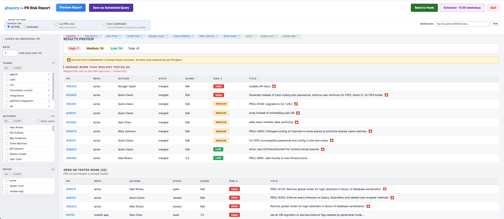

# ghquery

**PR risk analysis for QA teams.** ghquery fetches GitHub pull requests, runs AI-powered risk analysis on each one using local Claude subagents, and delivers a structured report to a chat webhook. Run it interactively via a web UI, from the command line, or on a daily schedule.



---

## What it does

- **Fetches PRs** from one or more GitHub repos, filtered by author and date range
- **Analyzes risk** on each PR in parallel using two-pass Claude subagents — one pass enumerates new code branches, a second pass scores risk across 6 dimensions (blast radius, complexity, regression surface, data integrity, security surface, infra/config)
- **Surfaces CodeRabbit data** when available — if a PR already has a CodeRabbit Change Impact summary, the AI passes are skipped entirely and CodeRabbit's verdict is used directly
- **Delivers a report** to a Slack-compatible incoming webhook with drilldowns for HIGH and MEDIUM risk PRs, QA recommendations, and an Untested / Reviewed split
- **Runs on a schedule** via the OS native scheduler (launchd on macOS, Task Scheduler on Windows, crontab on Linux)

---

## Prerequisites

### 1. Claude Code CLI

ghquery shells out to the local `claude` command for every PR analysis. Without it the tool can still fetch and list PRs, but all risk scores will return `UNKNOWN`.

```bash
npm install -g @anthropic-ai/claude-code
```

Requires Node.js 18 or later. Then authenticate once:

```bash
claude   # follow the OAuth prompts
```

Or set `ANTHROPIC_API_KEY` in your environment.

**Verify:**
```bash
claude --version
echo "ping" | claude -p
```

**Cost:** Each PR analysis is roughly 10,000–30,000 input tokens and ~2,000 output tokens (two-pass analysis). Five to ten PRs per daily run sits comfortably within a personal Anthropic Pro or Max plan.

### 2. GitHub Personal Access Token (recommended)

Without a token you get 60 GitHub API requests per hour, which runs out quickly on multi-repo queries. With a token you get 5,000/hour.

1. Go to **https://github.com/settings/tokens/new**
2. No scopes needed for public repos
3. If your org uses SAML SSO, click **Configure SSO** on the token and authorize your org
4. Paste the value into `config.yaml` under `github_token`

### 3. Incoming webhook URL (optional)

Required only if you want the report posted to a chat channel. Any Slack-compatible incoming webhook works. Leave `webhook_url` blank to use the web UI and terminal output only.

---

## Installation

Pre-compiled binaries for macOS, Windows, and Linux are available on the
[Releases page](https://github.com/DHaussermann/ghquery/releases).
Download the binary for your platform, then run `ghquery init` to verify
prerequisites and create a starter `config.yaml`.

### macOS

Download `ghquery-darwin-arm64` (Apple Silicon) or `ghquery-darwin-amd64`
(Intel) from the Releases page, then:

```bash
chmod +x ghquery-darwin-arm64
./ghquery-darwin-arm64 init
```

Or build from source (Go 1.23+ required):

```bash
git clone https://github.com/DHaussermann/ghquery.git
cd ghquery
go build -o ghquery .
./ghquery init
```

### Windows

Download `ghquery-windows-amd64.exe` from the Releases page, open
PowerShell in the same folder, and run:

```powershell
.\ghquery-windows-amd64.exe init
```

### Linux

Download `ghquery-linux-amd64` from the Releases page, then:

```bash
chmod +x ghquery-linux-amd64
./ghquery-linux-amd64 init
```

---

## Quick start

```bash
# 1. Copy the example config
cp config.example.yaml config.yaml

# 2. Edit config.yaml — minimum required fields:
#    github_token:  your personal access token
#    webhook_url:   your incoming webhook URL (leave blank to skip)
#    catalog.repos: repos to query
#    catalog.teams: your team's GitHub handles

# 3. Launch the web UI
./ghquery ui
# Opens http://localhost:3000 in your browser

# 4. Or run from the CLI
./ghquery run
```

---

## Configuration

`config.yaml` has four sections. See `config.example.yaml` for a fully-commented template.

```yaml
catalog:
  repos:
    - org/repo-one
    - org/repo-two
  teams:
    Engineering:
      - alice
      - bob
    QA:
      - charlie
  author_names:
    alice: Alice Anderson    # optional — shown in "Show names" toggle

query:
  repos:   [org/repo-one]
  authors: [alice, bob]
  days:    7
  mode:    untested          # untested | all
  skip_analysis: false       # true = list PRs without AI scoring (faster)

schedule:
  enabled:   false
  frequency: weekdays        # daily | weekdays | weekly
  time:      "08:00"
  tz:        "America/New_York"

github_token: ""
webhook_url:  ""
```

> **Note:** Comments in your live `config.yaml` are stripped on each save (a viper library limitation). Keep `config.example.yaml` as your annotated reference.

---

## Usage

### Web UI

```bash
./ghquery ui
```

Opens a browser UI where you can:
- Select repos, teams, and authors from checkboxes
- Set days, mode, and query options
- Click **Preview Report** to run analysis and see results
- Click **Send to Hook** to post to your webhook
- Click **Save as Scheduled Query** to persist settings for the scheduler

### CLI

```bash
./ghquery run          # interactive run using config.yaml defaults
./ghquery run --help   # all flags
```

### Scheduling

```bash
./ghquery schedule install    # registers with OS scheduler (run from a terminal where claude is on $PATH)
./ghquery schedule uninstall  # removes the scheduled job
./ghquery schedule status     # shows next scheduled run time
```

> **macOS note:** launchd runs with a minimal `$PATH`. `schedule install` captures your current shell's `$PATH` into the launchd plist automatically so `claude` is found when the job fires.

---

## Risk analysis

Each PR is analyzed in two sequential passes per agent (max 3 PRs concurrent):

| Pass | Timeout | What it does |
|------|---------|--------------|
| **A** — Branch enumeration | 90s | Lists every new code branch introduced by the diff and what each test change covers. No scoring. |
| **B** — Risk scoring | 120s | Runs the full risk skill with Pass A's branch list as pre-computed context. Scores 6 dimensions. |

**6 dimensions scored 0–10:**

| Dimension | Measures |
|-----------|----------|
| blast_radius | Files, directories, and system areas touched |
| complexity | Logic density — nested conditionals, concurrency, state mutations |
| regression_surface | Fragility of the touched area; uncovered new branches |
| data_integrity | Risk of data corruption — migrations, write queries, ORM changes |
| security_surface | Auth, input validation, secret handling |
| infra_config | CI/CD, deployment manifests, dependency upgrades |

Risk criteria live in `.claude/agents/risk-analyzer.md` — edit to tune scoring without recompiling.

### CodeRabbit integration

When the **Use CodeRabbit** toggle is on, ghquery checks each PR's description for a CodeRabbit Change Impact summary. If found, both agent passes are skipped and CodeRabbit's tier, regression risk, and QA recommendation are used directly — no tokens spent.

---

## Operating system support

| OS | Scheduling |
|----|-----------|
| macOS | launchd (LaunchAgents) |
| Windows | Task Scheduler (`schtasks`) |
| Linux | crontab |

---

## Further reading

- [`HOW-IT-WORKS.md`](HOW-IT-WORKS.md) — architecture, pipeline diagrams, risk scoring details
- [`SYSTEM_REQUIREMENTS.md`](SYSTEM_REQUIREMENTS.md) — full prerequisite checklist
- [`config.example.yaml`](config.example.yaml) — fully-commented configuration template
